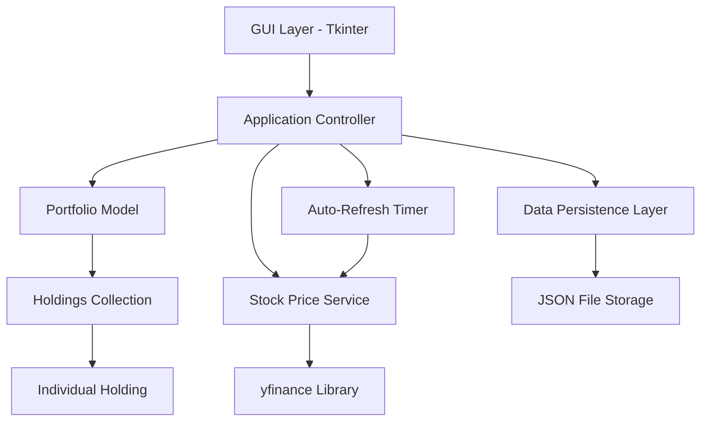

# Design Document: Stock Allocation Tool

## Overview

The Stock Allocation Tool is a desktop application built in Python that provides portfolio management capabilities with real-time stock price integration. The application features a tabular interface for managing stock holdings, setting target allocations, and receiving rebalancing recommendations. The system integrates with Yahoo Finance API through the yfinance library while providing both manual and optional auto-refresh functionality to manage API usage responsibly.

## Architecture

The application follows a Model-View-Controller (MVC) architecture with clear separation of concerns:



### Key Architectural Decisions

1. **GUI Framework**: Tkinter chosen for its simplicity, built-in availability with Python, and suitability for tabular data display
2. **Stock Data Source**: yfinance library provides reliable access to Yahoo Finance data with built-in error handling
3. **Data Persistence**: JSON format for human-readable, cross-platform portfolio storage
4. **Threading**: Background threads for API calls to maintain UI responsiveness
5. **Error Handling**: Graceful degradation with user-friendly error messages

## Components and Interfaces

### 1. GUI Layer (View)

**MainWindow Class**
- Manages the primary application window and layout
- Contains the portfolio table widget and control buttons
- Includes refresh button, auto-refresh toggle, share rounding toggle, dark mode toggle, and CSV export button
- Handles user input events and delegates to controller
- Manages theme switching and color scheme application

**PortfolioTable Class**
- Custom table widget for displaying portfolio data with optimized column layout
- Column order: Ticker, Price, Quantity, Target Allocation, Current Allocation, Current Value, Target Value, Difference, Rebalance Action
- Supports inline editing of quantities and target allocations
- Provides real-time calculation updates
- Displays formatted currency and percentage values
- Shows current stock prices fetched from API

**ErrorDialog Class**
- Displays dismissible error messages
- Handles different error types (invalid ticker, API failures, network issues)
- Non-blocking error presentation

### 2. Application Controller

**PortfolioController Class**
```python
class PortfolioController:
    def __init__(self):
        self.portfolio = Portfolio()
        self.stock_service = StockPriceService()
        self.storage = DataStorage()
        self.auto_refresh_timer = None
        self.share_rounding_enabled = True
        self.dark_mode_enabled = False
    
    def add_holding(self, ticker: str, quantity: float) -> None
    def update_holding_quantity(self, ticker: str, quantity: float) -> None
    def update_target_allocation(self, ticker: str, percentage: float) -> None
    def remove_holding(self, ticker: str) -> None
    def refresh_prices(self) -> None
    def toggle_auto_refresh(self, enabled: bool) -> None
    def toggle_share_rounding(self, enabled: bool) -> None
    def toggle_dark_mode(self, enabled: bool) -> None
    def export_to_csv(self) -> str
    def save_portfolio(self) -> None
    def load_portfolio(self) -> None
```

### 3. Portfolio Model

**Portfolio Class**
```python
class Portfolio:
    def __init__(self):
        self.holdings: Dict[str, Holding] = {}
    
    def add_holding(self, holding: Holding) -> None
    def remove_holding(self, ticker: str) -> None
    def get_total_value(self) -> float
    def get_allocation_summary(self) -> Dict[str, float]
    def calculate_rebalance_actions(self) -> Dict[str, int]
```

**Holding Class**
```python
class Holding:
    def __init__(self, ticker: str, quantity: float, target_allocation: float = 0.0):
        self.ticker = ticker
        self.quantity = quantity
        self.target_allocation = target_allocation
        self.current_price = 0.0
        self.last_updated = None
    
    def get_current_value(self) -> float
    def get_current_allocation(self, total_portfolio_value: float) -> float
    def get_target_value(self, total_portfolio_value: float) -> float
    def get_rebalance_action(self, total_portfolio_value: float, rounded: bool = True) -> float
```

### 4. Stock Price Service

**StockPriceService Class**
```python
class StockPriceService:
    def __init__(self):
        self.cache = {}
        self.last_refresh = None
    
    def get_current_price(self, ticker: str) -> float
    def get_multiple_prices(self, tickers: List[str]) -> Dict[str, float]
    def validate_ticker(self, ticker: str) -> bool
```

**Error Handling Strategy**:
- Invalid ticker symbols return specific error messages
- API failures are caught and reported with retry suggestions
- Network timeouts handled gracefully with cached data fallback
- Rate limiting detected and managed with appropriate user feedback

### 6. Theme Management Service

**ThemeManager Class**
```python
class ThemeManager:
    def __init__(self):
        self.current_theme = "light"
        self.light_colors = {
            "bg": "#ffffff",
            "fg": "#000000", 
            "table_bg": "#f8f9fa",
            "button_bg": "#e9ecef",
            "accent": "#007bff"
        }
        self.dark_colors = {
            "bg": "#2b2b2b",
            "fg": "#ffffff",
            "table_bg": "#3c3c3c", 
            "button_bg": "#4a4a4a",
            "accent": "#0d6efd"
        }
    
    def get_current_colors(self) -> Dict[str, str]
    def apply_theme(self, widget, theme: str) -> None
    def toggle_theme(self) -> str
    def save_theme_preference(self, theme: str) -> None
    def load_theme_preference(self) -> str
```

**Theme Features**:
- Light and dark color schemes optimized for readability
- Automatic application to all UI elements
- Theme preference persistence across sessions
- Immediate theme switching without restart required

### 7. CSV Export Service

**CSVExporter Class**
```python
class CSVExporter:
    def __init__(self):
        self.default_directory = "exports"
    
    def export_portfolio(self, portfolio: Portfolio, share_rounding: bool = True) -> str
    def generate_filename(self) -> str
    def format_portfolio_data(self, portfolio: Portfolio, share_rounding: bool) -> List[List[str]]
    def write_csv_file(self, filename: str, data: List[List[str]]) -> None
```

**Export Features**:
- Automatic timestamped filename generation (portfolio_YYYY-MM-DD_HH-MM-SS.csv)
- All visible table columns included in export
- Respects current share rounding setting
- Error handling for file system issues
- User notification of export success/failure and file location

### 8. Data Persistence Layer

**DataStorage Class**
```python
class DataStorage:
    def __init__(self, filename: str = "portfolio.json"):
        self.filename = filename
    
    def save_portfolio(self, portfolio: Portfolio) -> None
    def load_portfolio(self) -> Portfolio
    def backup_data(self) -> None
```

**JSON Schema**:
```json
{
  "version": "1.0",
  "last_saved": "2024-12-24T10:30:00Z",
  "holdings": [
    {
      "ticker": "AAPL",
      "quantity": 10.0,
      "target_allocation": 12.0,
      "last_price": 150.25,
      "last_updated": "2024-12-24T10:25:00Z"
    }
  ]
}
```

## Data Models

### Core Data Structures

**Holding Data Model**:
- `ticker`: String (stock symbol, uppercase)
- `quantity`: Float (number of shares owned)
- `target_allocation`: Float (desired percentage, 0-100)
- `current_price`: Float (latest price per share)
- `last_updated`: DateTime (timestamp of last price update)

**Portfolio Data Model**:
- `holdings`: Dictionary mapping ticker symbols to Holding objects
- `total_value`: Calculated property summing all holding values
- `allocation_total`: Calculated property summing all target allocations

**Calculated Fields**:
- `current_value`: quantity × current_price
- `current_allocation`: (current_value / total_portfolio_value) × 100
- `target_value`: (target_allocation / 100) × total_portfolio_value
- `difference`: target_value - current_value
- `rebalance_action`: difference / current_price (rounded or exact based on user preference)

## Correctness Properties

*A property is a characteristic or behavior that should hold true across all valid executions of a system—essentially, a formal statement about what the system should do. Properties serve as the bridge between human-readable specifications and machine-verifiable correctness guarantees.*

### Converting EARS to Properties

Based on the prework analysis, I'll convert the testable acceptance criteria into universally quantified properties, combining redundant properties for efficiency:

**Property 1: Portfolio State Management**
*For any* portfolio and any valid holding operation (add, update quantity, delete), the portfolio should correctly reflect the change and maintain data consistency across all holdings.
**Validates: Requirements 1.1, 1.2, 1.3**

**Property 2: Real-time Calculation Updates**
*For any* portfolio change (quantity, allocation, or price update), all dependent calculated fields (current value, allocation percentages, target values, rebalance actions) should update immediately and correctly.
**Validates: Requirements 1.5, 2.4, 4.2, 7.1**

**Property 3: Target Allocation Management**
*For any* valid target allocation percentage (0-100%), the system should store the value and correctly calculate allocation totals, regardless of whether the total equals 100%.
**Validates: Requirements 2.1, 2.2, 2.5**

**Property 4: UI Functionality During Invalid States**
*For any* portfolio state where allocations don't sum to 100% or errors occur, the UI should remain fully functional and responsive for all operations.
**Validates: Requirements 2.3, 7.2, 7.5**

**Property 5: Stock Price Integration**
*For any* valid ticker symbol, the system should successfully fetch prices from the API and update all price-dependent calculations correctly.
**Validates: Requirements 3.1, 3.2**

**Property 6: Price Data Persistence and Display**
*For any* successful price fetch, the system should store the timestamp and display current price information alongside holdings data.
**Validates: Requirements 3.4, 3.5**

**Property 7: Manual Refresh Functionality**
*For any* portfolio state and auto-refresh setting, manual refresh should fetch current prices for all holdings and update all calculations.
**Validates: Requirements 4.1, 4.4, 4.5**

**Property 8: Auto-refresh State Management**
*For any* auto-refresh toggle state change, the system should immediately start or stop automatic updates as appropriate.
**Validates: Requirements 5.4**

**Property 9: Rebalance Calculation Accuracy**
*For any* holding with current price and target allocation, the system should correctly calculate target value, difference, and rebalance action with optional rounding to whole shares based on user preference.
**Validates: Requirements 6.1, 6.2, 6.3, 6.4, 6.5**

**Property 10: Rebalance Action Direction and Rounding**
*For any* calculated rebalance action, positive values should indicate buy recommendations, negative values should indicate sell recommendations, zero target allocations should recommend selling all shares, and the display should respect the share rounding toggle setting.
**Validates: Requirements 6.6, 6.7, 6.8, 6.9, 6.10**

**Property 11: Error Handling with Graceful Degradation**
*For any* error condition (invalid ticker, API failure, network issue), the system should display appropriate dismissible error messages while maintaining existing data and functionality.
**Validates: Requirements 8.1, 8.2, 8.3, 8.4, 8.5, 8.6**

**Property 12: Data Persistence Round-trip**
*For any* portfolio state, saving and then loading the portfolio should result in identical data (holdings, quantities, allocations, and last known prices).
**Validates: Requirements 9.1, 9.2, 9.3, 9.4**

**Property 13: Dark Mode Theme Consistency**
*For any* theme toggle operation, all UI elements should immediately reflect the new color scheme with proper contrast and readability maintained.
**Validates: Requirements 10.3, 10.4, 10.6, 10.7**

**Property 14: CSV Export Accuracy**
*For any* portfolio state, exporting to CSV and parsing the resulting file should contain all visible table data with correct formatting and no data loss.
**Validates: Requirements 11.2, 11.3, 11.4**

**Property 15: Data Corruption Recovery**
*For any* corrupted data file, the system should detect the corruption, notify the user, and either recover gracefully or start with a clean state without crashing.
**Validates: Requirements 12.5**

## Error Handling

### Error Categories and Responses

**1. Input Validation Errors**
- Invalid ticker symbols: Display "[ticker] not found" with dismissible warning
- Invalid quantities: Prevent input and show validation message
- Invalid percentages: Constrain to 0-100% range with user feedback

**2. API Integration Errors**
- Yahoo Finance unavailable: "Yahoo Finance isn't working, try again later"
- Rate limiting: "API rate limit exceeded, please use manual refresh"
- Network connectivity: "Network error, using cached prices"
- Timeout errors: "Request timed out, retrying with cached data"

**3. Data Persistence Errors**
- File corruption: "Portfolio data corrupted, starting fresh"
- Permission errors: "Cannot save portfolio, check file permissions"
- Disk space: "Insufficient disk space for saving portfolio"

**4. System Errors**
- Threading errors: Log error, continue with single-threaded operation
- Memory errors: Display warning and suggest closing other applications
- Unexpected exceptions: Log error, display generic error message

### Error Recovery Strategies

1. **Graceful Degradation**: System continues operating with reduced functionality
2. **Data Preservation**: Always maintain existing data when errors occur
3. **User Notification**: Clear, actionable error messages
4. **Automatic Retry**: Retry failed operations with exponential backoff
5. **Fallback Modes**: Use cached data when live data unavailable

## Testing Strategy

### Dual Testing Approach

The testing strategy employs both unit tests and property-based tests to ensure comprehensive coverage:

**Unit Tests** focus on:
- Specific examples demonstrating correct behavior
- Edge cases and boundary conditions
- Error conditions and exception handling
- Integration points between components
- UI component behavior with known inputs

**Property-Based Tests** focus on:
- Universal properties that hold across all valid inputs
- Comprehensive input coverage through randomization
- Invariant preservation during operations
- Round-trip properties for data persistence
- Calculation accuracy across wide input ranges

### Property-Based Testing Configuration

- **Framework**: Hypothesis for Python property-based testing
- **Test Iterations**: Minimum 100 iterations per property test
- **Test Tagging**: Each property test references its design document property
- **Tag Format**: **Feature: stock-allocation-tool, Property {number}: {property_text}**

### Testing Framework Selection

**Primary Framework**: pytest with Hypothesis
- pytest provides excellent test discovery and reporting
- Hypothesis enables sophisticated property-based testing
- Integration with coverage tools for comprehensive metrics
- Support for parameterized tests and fixtures

**GUI Testing**: pytest-qt for Tkinter testing
- Automated GUI interaction testing
- Event simulation and widget state verification
- Integration with main test suite

**Mock Testing**: unittest.mock for API testing
- Mock yfinance API calls for reliable testing
- Simulate various error conditions
- Test error handling without external dependencies

### Application Packaging

The application supports packaging into a standalone executable for personal use without requiring a Python installation or terminal window.

**Packaging Strategy**:
- **PyInstaller**: Creates single executable with all dependencies bundled
- **Windowed Mode**: Runs without terminal window (GUI-only)
- **Entry Point**: Clean main.py entry point for packaging
- **Path Handling**: Proper resource path resolution for packaged execution

**Build Process**:
```bash
# Install packaging dependencies
pip install pyinstaller

# Create standalone executable
pyinstaller --onefile --windowed --name "Stock Allocation Tool" src/main.py

# Result: dist/Stock Allocation Tool.exe (Windows) or dist/Stock Allocation Tool (macOS/Linux)
```

**Benefits**:
- No terminal window required
- No Python installation needed on target machine
- Double-click to run like any native application
- All dependencies bundled automatically

### Test Organization

```
tests/
├── unit/
│   ├── test_portfolio.py
│   ├── test_holding.py
│   ├── test_stock_service.py
│   └── test_data_storage.py
├── property/
│   ├── test_portfolio_properties.py
│   ├── test_calculation_properties.py
│   └── test_persistence_properties.py
├── integration/
│   ├── test_api_integration.py
│   └── test_gui_integration.py
└── fixtures/
    ├── sample_portfolios.py
    └── mock_api_responses.py
```

### Test Data Generation

**Property Test Generators**:
- Valid ticker symbols (3-5 uppercase letters)
- Realistic stock quantities (0.001 to 10,000 shares)
- Valid allocation percentages (0.0 to 100.0)
- Realistic stock prices ($0.01 to $10,000)
- Portfolio states with various allocation totals

**Edge Case Coverage**:
- Empty portfolios
- Single holding portfolios
- Portfolios with zero allocations
- Extreme price values
- Network timeout scenarios
- Corrupted data files